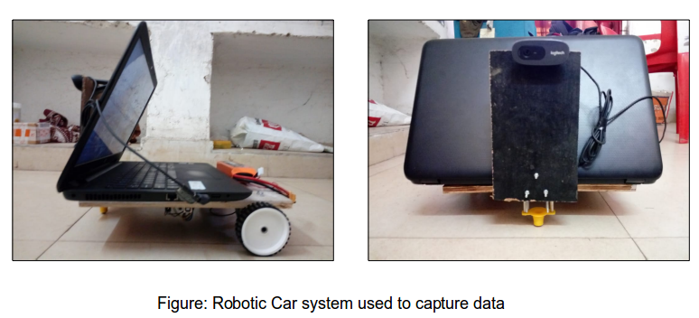
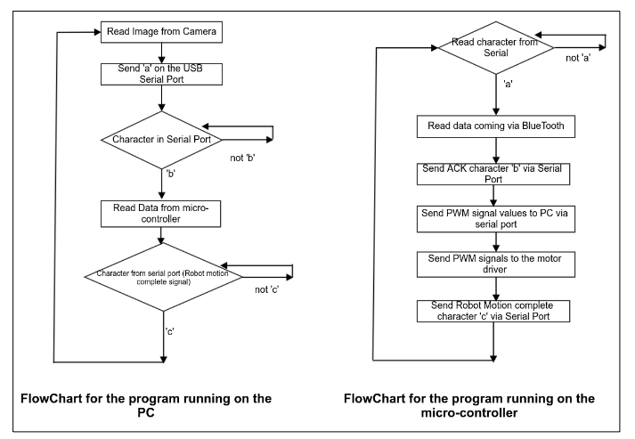

# Dataset Generation

The robotic car that was used in this work, (see above figure) , consists of three primary subsystems: 
1. a portable Personal Computer (PC),
2. a micro-controller 
3. a Smart Phone cum orientation sensor

## Communication protocol flowchart

## Implementation
*Arduino UNO* board was used as a micro-controller based prototyping board. We use an Android application i.e. *Sensoduino* for sending the orientation sensor values via Bluetooth to the micro-controller.
The PC runs a version of the Linux distribution Ubuntu and the software is written in python and uses OpenCV (version 3.0) as its imaging library [1]. The PC
communicates with the micro-controller through a serial port over USB. The entire algorithm including the communication between the PC and the micro-
controller is represented in above given flowchart.
