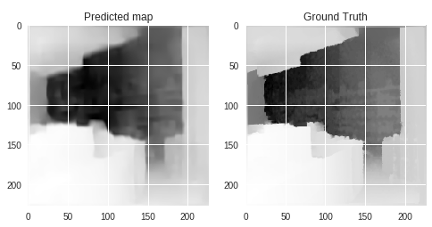

# 3D obstacle avoidance using visual perception
This repository contains the entire source code for my BTech thesis project. This is a work of Pranoy Panda and Prof. Manish Okade and this was done while I was an undergraduate student at National Institute of Technology, Rourkela.

## Problem Statement: 
Given a monocular Image x(t) generate control commands for a robot to avoid 3-D obstacles in the environment.

## Approach:
Our approach deals with the task of obstacle avoidance as a two step process. The first step being depth estimation from monocular image. The second step being,
mapping the information from depth map to control command for the robot. *The novelty in this work is present mainly in the 1st stage of the pipeline i.e. monocular depth estimation.*

### 1. Monocular depth estimation for scene representation

This stage of the pipeline of our project focused on generating a representation of the scene and then feeding it as an input to a control algorithm. More information regarding this section can be found [here](https://github.com/pranoy-panda/BTech_project/blob/master/mono_depth_est/README.md#my-projects-readme)

### 2. Mapping depth map to motor commands
This stage uses a simple/naive convolutional neural network to map the information in the depth map to control commands. This stage although doesnot have any novelty but creating a dataset for this network was really a challenge. It was challenging as I had to develope a small robot(with the help of my friend [Ippili Sidhartha Kumar](https://www.linkedin.com/in/ippili-sidhartha-kumar-307443112/)) from scratch and also design a communication protocol for communication between a micro-controller and a PC.
For more information regarding the dataset generation part please refer to this [link](https://github.com/pranoy-panda/BTech_project/blob/master/Dataset_generation_planning/README.md). For more information regarding the naive CNN model please refer this [link](https://github.com/pranoy-panda/BTech_project/blob/master/naive_network_planning/README.md).

## Conclusion:
The amount of data required for training a deep fully convolutional network for
depth estimation is very large. Prior works on this topic have used much more than
10k images, whereas my work only uses a set of 1100 images from NYU v2 depth
dataset(I did not have resources to train my model on larger data sets). Hence, the amount of generalization achieved by our model is less in comparison to other works in this area.
In our work, we also generate a custom dataset which consisted of raw images
and the corresponding steering commands for the robot. A custom dataset was generated as no freely available dataset exist which would be suitable for our purpose.
Finally, more data and compute time could help improve both the models performance i.e. for both the monocular depth estimation network and control com
mand estimation network. This is because the mappings to be learned by these deep
learning models is complex in nature and hence large amount of data is required to
find pattern in it.

Future scope of this project involves collecting more data for better testing accuracy of both the models.
