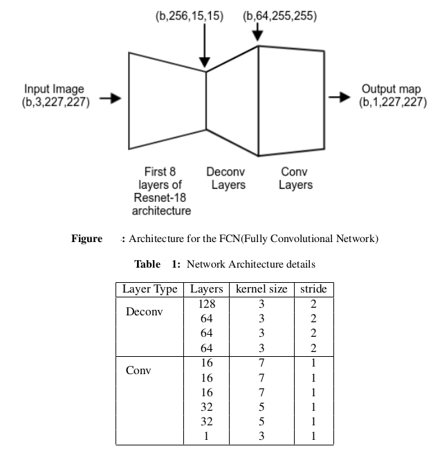
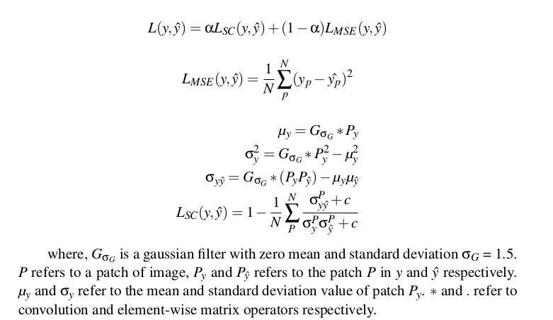

# Monocular Depth Estimation
The underlying rationale of this problem of monocular depth estimation is inspired by the possibility of
human depth perception from single images. 

How do humans do it? 

Humans are able to achieve this feat due to their prior experience. This experience helps them to estimate the depth by using various cues like shadows, lighting condition, size of object etc. The logic behind building a monocular depth estimation model is that the learning algorithm should be able to capture the above mentioned cues and hence give a reasonable estimate of the depth.

## Approach:
My approach was to use a fully convolutional network architecture(sort of like an autoencoder, but the only difference being that here input is an image(3D) and output is a depth map(2D map)). A fully convolutional net tries to learn representations and make decisions based on local spatial input by learning the optimal filters that minimize the depth map construction error.

Now, in order to improve upon currently existing(i.e. in 2019) deep learning based approaches I thought of working explicity on the loss function rather than fiddling much with the network architecture.

### Network architecture

### Loss function
A standard loss function for depth regression problems considers the difference
between the ground- truth depth map y and the prediction of the depth regression
network . Different considerations regarding the loss function can have a significant
effect on the training speed and the overall depth estimation performance. Many
variations on the loss function employed for optimizing the neural network can be
found in the depth estimation literature. In our method, we use a novel loss
function derived from the SSIM metric along with Mean Squared error between y and ŷ.
That is, for training our network, we define the loss L between y (actual depth
map) and ŷ (estimated depth map) as the weighted sum of two loss functions:

### Data Augmentation Policy
NYU Depth v2 contains 1449 densely labelled pairs of aligned RGB and depth images. We train our method on the entire dataset with data augmentation. The data augmentation schemes used in our work are as follows: horizontal
flipping (i.e. mirroring) of images. Image rotation is another useful augmentation
strategy, however, since it introduces invalid data for the corresponding ground-truth
depth we do not include it. We also add Gaussian noise, with zero mean, which
essentially has data points in all frequencies, effectively distorting the high frequency
features and hence enabling the learning model to work even in the presence of blur.

### Implementation
We implemented our proposed depth estimation network using pyTorch and trained
on NVIDIA Tesla k80 GPU with 12GB memory via the Google colaboratory (free to use servers for training machine learning models). The weights for the network are randomly initialized following Xavier initialization. In all experiments,
we used the ADAM optimizer with initial learning rate 0.0001. The batch size is set to 16. The total number of trainable parameters for the entire network is approximately 0.5M parameters.

### Acknowledgement
Big thanks to Google for providing free access to GPU servers.

[Google Colab](http://colab.research.google.com/)
