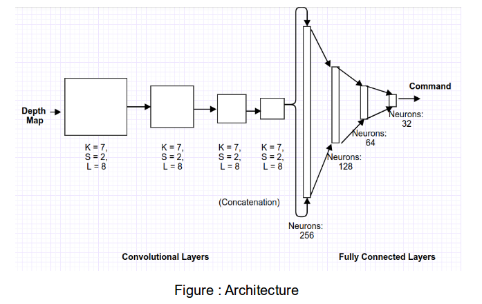

# CNN for Mapping depth map to motor commands

## Network Details
- Number of parameters: 0.5 M
- Optimizer: Adam (initial learning rate :3e-05)
- Number of epochs: 500
- Batch size: 2
- Training Platform: Intel i5 processor CPU,8 GB RAM
